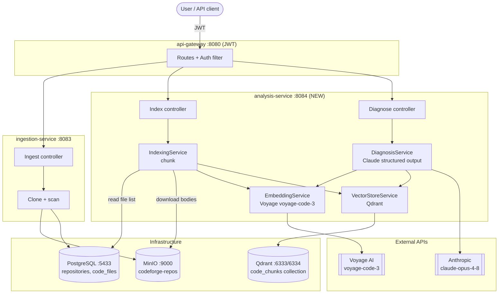
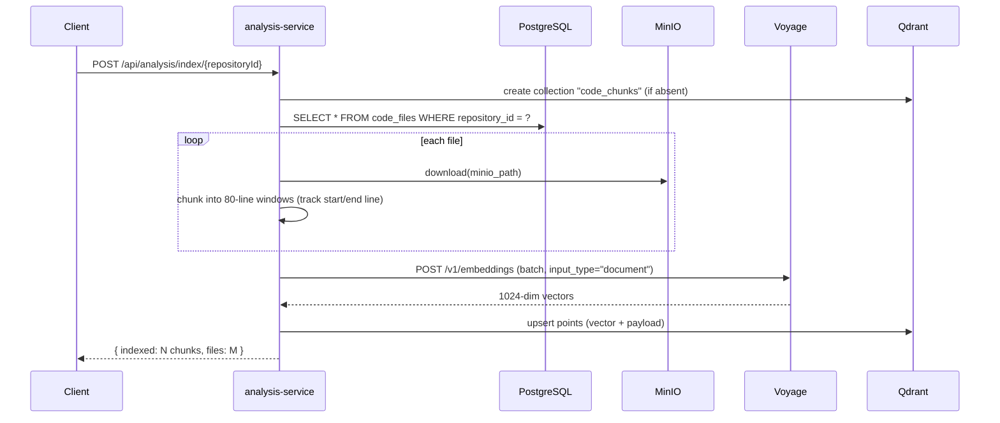
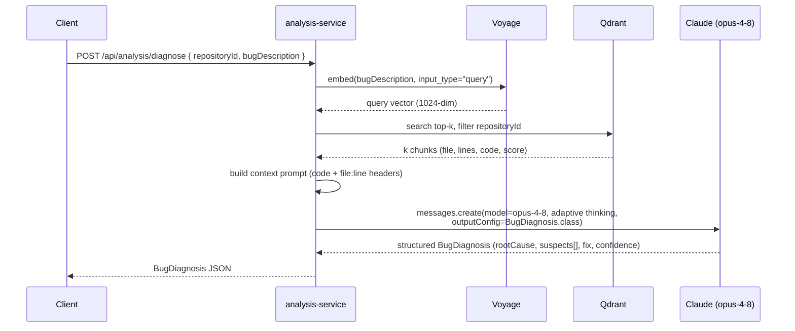

# CodeForge AI — MVP Implementation Plan (RAG + Bug Diagnosis Agent)

> **Purpose of this file:** a complete, self-contained blueprint for the CodeForge AI MVP.
> It covers scope, architecture, the RAG pipeline, working diagrams, full Java code, config,
> a step-by-step build order, a demo script, and interview talking points. It is a *plan* —
> nothing here has been applied to the codebase. Build it yourself, section by section.
>
> Stack: **Java 21 · Spring Boot 4.1 · PostgreSQL · MinIO · Qdrant · Claude (Anthropic Java SDK) · Voyage embeddings**

---

## Table of Contents

1. [MVP Scope](#1-mvp-scope)
2. [What Already Exists](#2-what-already-exists)
3. [High-Level Architecture](#3-high-level-architecture)
4. [RAG — The Core Concept](#4-rag--the-core-concept-know-this-for-interviews)
5. [The New Module: `analysis-service`](#5-the-new-module-analysis-service)
6. [Data & Vector Schema](#6-data--vector-schema)
7. [Working Diagrams (Indexing + Diagnosis)](#7-working-diagrams)
8. [API Endpoints](#8-api-endpoints)
9. [Full Code](#9-full-code)
10. [Configuration & Env Vars](#10-configuration--env-vars)
11. [Build Order (Step-by-Step Checklist)](#11-build-order-step-by-step-checklist)
12. [Demo Script](#12-demo-script)
13. [Gotchas & Pitfalls](#13-gotchas--pitfalls)
14. [Future Enhancements](#14-future-enhancements)
15. [Interview Talking Points](#15-interview-talking-points)

---

## 1. MVP Scope

**Keep (the impressive core):**

| Piece | What it demonstrates |
|---|---|
| API Gateway + Auth Service (JWT) | Security / auth knowledge |
| Repository ingestion (clone → MinIO → Postgres) | Real-world integration |
| **RAG pipeline + one AI agent (Bug Diagnosis)** | **AI / LLM knowledge** |
| Qdrant (vectors) + PostgreSQL (metadata) | Database depth |

**Cut completely:** the other 6 agents, sandbox execution, GitHub PR integration, frontend, monitoring stack.

**The one new thing you build:** an `analysis-service` that (a) indexes an ingested repo into Qdrant, and (b) answers "why is this broken?" using retrieval-augmented generation over that index, with Claude producing a structured diagnosis.

---

## 2. What Already Exists

- **`auth-service`** — JWT issue/verify.
- **`api-gateway`** — routes + JWT filter, forwards `X-User-Email`.
- **`ingestion-service`** — `POST /api/ingest/repository` clones a repo with JGit (`--depth 1`), scans files, uploads each to MinIO (`bucket: codeforge-repos`, key `repoId/relativePath`), and writes metadata to Postgres:
  - `repositories` (id, name, url, branch, status, …)
  - `code_files` (id, `repository_id`, `file_path`, `file_name`, `language`, `file_size`, `minio_path`, …)
- **Infra (Docker):** Postgres `:5433`, Qdrant `:6333`, MinIO `:9000`, Grafana `:3000`.

> The MVP **reuses `code_files` + MinIO as the source of truth** for what to index. `analysis-service` reads the file list from Postgres and downloads each file body from MinIO — no re-clone needed.

---

## 3. High-Level Architecture



**Tech choices at a glance**

| Concern | Choice | Why |
|---|---|---|
| LLM (reasoning) | `claude-opus-4-8` (Anthropic Java SDK) | Most capable; adaptive thinking; structured outputs |
| Embeddings | Voyage `voyage-code-3` (free tier) | Purpose-built for **code**; Anthropic's recommended pairing; Anthropic has **no** embeddings API |
| Vector DB | Qdrant | Already running; great filtering + payload support |
| Metadata / source list | PostgreSQL `code_files` | Already populated by ingestion |
| File bodies | MinIO | Already populated by ingestion |

---

## 4. RAG — The Core Concept (know this for interviews)

**RAG = Retrieval-Augmented Generation.** An LLM only knows its training data + what you put in the prompt. It has never seen *this user's private repo*. RAG bridges that gap:

1. **Index (offline):** split the codebase into chunks → convert each chunk to a **vector** (embedding) that captures its meaning → store vectors + metadata in a **vector DB** (Qdrant).
2. **Retrieve (per query):** embed the user's question with the **same** model → find the nearest chunk vectors by **cosine similarity** → these are the most semantically relevant pieces of code.
3. **Augment + Generate:** stuff those retrieved chunks into the prompt as context → the LLM (Claude) answers grounded in *actual* code, and cites file/line.

**Why embeddings (not keyword search)?** "login broken" should match code about `authenticate`, `verifyToken`, `session` — even if the word "login" never appears. Embeddings capture *meaning*, so semantically related code is retrieved even without literal keyword overlap.

**Why a code-specific embedding model (`voyage-code-3`)?** General text models under-represent code structure (identifiers, call graphs, syntax). A code-tuned model produces embeddings where semantically related code lands closer together → better retrieval → better answers.

**Why the LLM still matters after retrieval:** retrieval finds *relevant* code; the LLM *reasons* over it — connecting a null-check in `AuthService` to a NPE the user described, and proposing a fix. Retrieval without reasoning is just search; reasoning without retrieval hallucinates about code it can't see.

---

## 5. The New Module: `analysis-service`

A new Spring Boot module (port **8084**), added to the parent `pom.xml` `<modules>` list.

```
analysis-service/
├── pom.xml
└── src/main/
    ├── java/com/codeforge/analysis/
    │   ├── AnalysisServiceApplication.java
    │   ├── controller/AnalysisController.java
    │   ├── service/
    │   │   ├── IndexingService.java        # orchestrates chunk → embed → upsert
    │   │   ├── ChunkingService.java        # splits file text into line-window chunks
    │   │   ├── EmbeddingService.java        # Voyage voyage-code-3 REST client
    │   │   ├── VectorStoreService.java      # Qdrant create/upsert/search
    │   │   ├── DiagnosisService.java        # RAG retrieve + Claude structured output
    │   │   └── FileSourceService.java       # reads code_files (JPA) + MinIO bodies
    │   ├── config/QdrantConfig.java
    │   ├── dto/
    │   │   ├── DiagnoseRequest.java
    │   │   ├── BugDiagnosis.java            # Claude's structured output type
    │   │   ├── SuspectLocation.java
    │   │   └── RetrievedChunk.java
    │   └── entity/CodeFile.java             # read-only view of code_files (or share from common)
    └── resources/application.yml
```

### `pom.xml` dependencies

```xml
<dependencies>
    <!-- Web -->
    <dependency>
        <groupId>org.springframework.boot</groupId>
        <artifactId>spring-boot-starter-web</artifactId>
    </dependency>

    <!-- Read code_files metadata -->
    <dependency>
        <groupId>org.springframework.boot</groupId>
        <artifactId>spring-boot-starter-data-jpa</artifactId>
    </dependency>
    <dependency>
        <groupId>org.postgresql</groupId>
        <artifactId>postgresql</artifactId>
    </dependency>

    <!-- Claude (the LLM) -->
    <dependency>
        <groupId>com.anthropic</groupId>
        <artifactId>anthropic-java</artifactId>
        <version>2.34.0</version>
    </dependency>

    <!-- Qdrant vector DB (gRPC client) -->
    <dependency>
        <groupId>io.qdrant</groupId>
        <artifactId>client</artifactId>
        <version>1.12.0</version>
    </dependency>

    <!-- MinIO (download file bodies) -->
    <dependency>
        <groupId>io.minio</groupId>
        <artifactId>minio</artifactId>
        <version>8.5.7</version>
    </dependency>

    <!-- Lombok + common -->
    <dependency>
        <groupId>org.projectlombok</groupId>
        <artifactId>lombok</artifactId>
        <optional>true</optional>
    </dependency>
    <dependency>
        <groupId>com.codeforge</groupId>
        <artifactId>common</artifactId>
    </dependency>
</dependencies>
```

> Voyage is called over plain HTTP with Spring's `RestClient` — no SDK dependency needed.

---

## 6. Data & Vector Schema

### Qdrant collection: `code_chunks`

| Property | Value |
|---|---|
| Vector size | **1024** (voyage-code-3 default output dimension) |
| Distance | **Cosine** |
| Point ID | random UUID per chunk |

**Payload stored per chunk (used for filtering + citations):**

```json
{
  "repositoryId": "571c7543-…",
  "filePath": "src/main/java/.../AuthService.java",
  "fileName": "AuthService.java",
  "language": "Java",
  "startLine": 42,
  "endLine": 108,
  "content": "public boolean verifyToken(String jwt) { ... }"
}
```

- `repositoryId` is an **indexed keyword** so every search is filtered to one repo (multi-tenant safe).
- `content` is stored so we can feed the exact chunk text to Claude without a second MinIO fetch.

### Chunking strategy (MVP)

Line-window chunker — simple, language-agnostic, and preserves line numbers for citations:

- Window: **~80 lines**, overlap: **15 lines** (overlap avoids splitting a function across a boundary with no context).
- Track `startLine` / `endLine` (1-indexed) for each chunk.
- Skip binary/noise files (reuse ingestion's skip rules; `code_files` already excluded images/jars).
- Cap chunk size to stay well under `voyage-code-3`'s 32K-token input limit (80 lines ≈ 400–900 tokens — safe).

> **Upgrade path (post-MVP):** AST/function-aware chunking per language gives cleaner boundaries. Not needed for the demo.

---

## 7. Working Diagrams

### 7a. Indexing (offline, once per repo)



### 7b. Bug Diagnosis (per query — the RAG loop)



---

## 8. API Endpoints

All behind `api-gateway` (JWT). `X-User-Email` is forwarded by the gateway.

| Method | Path | Body | Purpose |
|---|---|---|---|
| `POST` | `/api/analysis/index/{repositoryId}` | — | Index (or re-index) a repo into Qdrant |
| `POST` | `/api/analysis/diagnose` | `{ repositoryId, bugDescription }` | RAG bug diagnosis → structured `BugDiagnosis` |
| `POST` | `/api/analysis/ask` | `{ repositoryId, question }` | (bonus, near-free) RAG Q&A over the repo |
| `GET`  | `/api/analysis/index/{repositoryId}/status` | — | Chunk count / indexed state |

---

## 9. Full Code

> Package root: `com.codeforge.analysis`. Code is written to be copy-paste-close; verify method
> names against the exact `io.qdrant:client` and `anthropic-java` versions you pull.

### 9.1 Application entry point (with the timezone fix baked in)

```java
package com.codeforge.analysis;

import org.springframework.boot.SpringApplication;
import org.springframework.boot.autoconfigure.SpringBootApplication;

import java.util.TimeZone;

@SpringBootApplication
public class AnalysisServiceApplication {
    public static void main(String[] args) {
        // Same fix ingestion-service needed: some JVMs default to the legacy alias
        // "Asia/Calcutta", which PostgreSQL 16 rejects on connect and crashes startup.
        TimeZone.setDefault(TimeZone.getTimeZone("Asia/Kolkata"));
        SpringApplication.run(AnalysisServiceApplication.class, args);
    }
}
```

### 9.2 DTOs

```java
package com.codeforge.analysis.dto;

public record DiagnoseRequest(String repositoryId, String bugDescription) {}
```

```java
package com.codeforge.analysis.dto;

import com.fasterxml.jackson.annotation.JsonPropertyDescription;

// A single suspected bug location — Claude fills this from the retrieved code.
public record SuspectLocation(
        @JsonPropertyDescription("Repo-relative file path, copied exactly from the provided context")
        String filePath,
        @JsonPropertyDescription("1-indexed start line of the suspect region")
        int startLine,
        @JsonPropertyDescription("1-indexed end line of the suspect region")
        int endLine,
        @JsonPropertyDescription("Why this location is implicated in the bug")
        String reason
) {}
```

```java
package com.codeforge.analysis.dto;

import com.fasterxml.jackson.annotation.JsonClassDescription;
import com.fasterxml.jackson.annotation.JsonPropertyDescription;
import java.util.List;

// This is the STRUCTURED OUTPUT type Claude is forced to return.
@JsonClassDescription("A structured diagnosis of a software bug based only on the provided code context")
public record BugDiagnosis(
        @JsonPropertyDescription("One-paragraph explanation of the most likely root cause")
        String rootCause,
        @JsonPropertyDescription("Ranked list of suspect code locations, most likely first")
        List<SuspectLocation> suspects,
        @JsonPropertyDescription("Concrete suggested fix, referencing the suspect locations")
        String suggestedFix,
        @JsonPropertyDescription("Confidence: one of HIGH, MEDIUM, LOW")
        String confidence
) {}
```

```java
package com.codeforge.analysis.dto;

// One chunk returned from Qdrant search.
public record RetrievedChunk(
        String filePath, int startLine, int endLine,
        String language, String content, float score
) {}
```

### 9.3 EmbeddingService — Voyage `voyage-code-3`

```java
package com.codeforge.analysis.service;

import lombok.extern.slf4j.Slf4j;
import org.springframework.beans.factory.annotation.Value;
import org.springframework.http.MediaType;
import org.springframework.stereotype.Service;
import org.springframework.web.client.RestClient;

import java.util.List;

@Slf4j
@Service
public class EmbeddingService {

    private static final String MODEL = "voyage-code-3";      // 1024-dim, code-specialized
    private final RestClient http;

    public EmbeddingService(@Value("${voyage.api-key}") String apiKey) {
        this.http = RestClient.builder()
                .baseUrl("https://api.voyageai.com/v1")
                .defaultHeader("Authorization", "Bearer " + apiKey)
                .defaultHeader("Content-Type", MediaType.APPLICATION_JSON_VALUE)
                .build();
    }

    /** input_type "document" for chunks you store, "query" for the user's question. */
    public List<float[]> embed(List<String> texts, String inputType) {
        VoyageResponse resp = http.post()
                .uri("/embeddings")
                .body(new VoyageRequest(texts, MODEL, inputType))
                .retrieve()
                .body(VoyageResponse.class);

        return resp.data().stream()
                .sorted((a, b) -> Integer.compare(a.index(), b.index())) // preserve input order
                .map(d -> toFloatArray(d.embedding()))
                .toList();
    }

    public float[] embedOne(String text, String inputType) {
        return embed(List.of(text), inputType).get(0);
    }

    private float[] toFloatArray(List<Double> v) {
        float[] out = new float[v.size()];
        for (int i = 0; i < v.size(); i++) out[i] = v.get(i).floatValue();
        return out;
    }

    // --- wire types ---
    record VoyageRequest(List<String> input, String model, String input_type) {}
    record VoyageEmbedding(List<Double> embedding, int index) {}
    record VoyageResponse(List<VoyageEmbedding> data, String model) {}
}
```

> **Free-tier tips:** batch many chunks per request (Voyage accepts a list), and if you hit a rate
> limit while indexing a big repo, add a small sleep between batches. `voyage-code-3` handles up to
> 32K tokens per input and large batches per call.

### 9.4 ChunkingService

```java
package com.codeforge.analysis.service;

import com.codeforge.analysis.dto.RetrievedChunk; // reuse shape (score unused while indexing)
import org.springframework.stereotype.Service;

import java.util.ArrayList;
import java.util.List;

@Service
public class ChunkingService {

    private static final int WINDOW = 80;   // lines per chunk
    private static final int OVERLAP = 15;  // lines shared with previous chunk

    public record Chunk(int startLine, int endLine, String content) {}

    public List<Chunk> chunk(String fileText) {
        String[] lines = fileText.split("\n", -1);
        List<Chunk> chunks = new ArrayList<>();
        int step = WINDOW - OVERLAP;

        for (int start = 0; start < lines.length; start += step) {
            int end = Math.min(start + WINDOW, lines.length);
            StringBuilder sb = new StringBuilder();
            for (int i = start; i < end; i++) sb.append(lines[i]).append('\n');
            String content = sb.toString().strip();
            if (!content.isEmpty()) {
                chunks.add(new Chunk(start + 1, end, content)); // 1-indexed lines
            }
            if (end == lines.length) break;
        }
        return chunks;
    }
}
```

### 9.5 VectorStoreService — Qdrant

```java
package com.codeforge.analysis.service;

import com.codeforge.analysis.dto.RetrievedChunk;
import io.qdrant.client.QdrantClient;
import io.qdrant.client.grpc.Collections.Distance;
import io.qdrant.client.grpc.Collections.VectorParams;
import io.qdrant.client.grpc.Points.*;
import lombok.RequiredArgsConstructor;
import lombok.extern.slf4j.Slf4j;
import org.springframework.stereotype.Service;

import java.util.List;
import java.util.Map;
import java.util.UUID;

import static io.qdrant.client.ConditionFactory.matchKeyword;
import static io.qdrant.client.PointIdFactory.id;
import static io.qdrant.client.ValueFactory.value;
import static io.qdrant.client.VectorsFactory.vectors;

@Slf4j
@Service
@RequiredArgsConstructor
public class VectorStoreService {

    public static final String COLLECTION = "code_chunks";
    private static final int DIM = 1024;   // voyage-code-3 default
    private final QdrantClient qdrant;

    public void ensureCollection() throws Exception {
        boolean exists = qdrant.collectionExistsAsync(COLLECTION).get();
        if (!exists) {
            qdrant.createCollectionAsync(COLLECTION,
                    VectorParams.newBuilder().setSize(DIM).setDistance(Distance.Cosine).build()
            ).get();
            log.info("Created Qdrant collection {}", COLLECTION);
        }
    }

    /** One upsert per chunk. In practice, batch these into a single upsertAsync(List<PointStruct>). */
    public void upsert(String repositoryId, String filePath, String fileName, String language,
                       int startLine, int endLine, String content, float[] vector) throws Exception {
        PointStruct point = PointStruct.newBuilder()
                .setId(id(UUID.randomUUID()))
                .setVectors(vectors(vector))
                .putAllPayload(Map.of(
                        "repositoryId", value(repositoryId),
                        "filePath", value(filePath),
                        "fileName", value(fileName),
                        "language", value(language == null ? "Unknown" : language),
                        "startLine", value(startLine),
                        "endLine", value(endLine),
                        "content", value(content)
                ))
                .build();
        qdrant.upsertAsync(COLLECTION, List.of(point)).get();
    }

    public List<RetrievedChunk> search(String repositoryId, float[] queryVector, int topK) throws Exception {
        List<ScoredPoint> results = qdrant.searchAsync(SearchPoints.newBuilder()
                .setCollectionName(COLLECTION)
                .addAllVector(toList(queryVector))
                .setLimit(topK)
                .setWithPayload(WithPayloadSelector.newBuilder().setEnable(true).build())
                .setFilter(Filter.newBuilder()
                        .addMust(matchKeyword("repositoryId", repositoryId))
                        .build())
                .build()).get();

        return results.stream().map(p -> {
            Map<String, io.qdrant.client.grpc.JsonWithInt.Value> pl = p.getPayloadMap();
            return new RetrievedChunk(
                    pl.get("filePath").getStringValue(),
                    (int) pl.get("startLine").getIntegerValue(),
                    (int) pl.get("endLine").getIntegerValue(),
                    pl.get("language").getStringValue(),
                    pl.get("content").getStringValue(),
                    p.getScore());
        }).toList();
    }

    private List<Float> toList(float[] v) {
        List<Float> out = new java.util.ArrayList<>(v.length);
        for (float f : v) out.add(f);
        return out;
    }
}
```

```java
package com.codeforge.analysis.config;

import io.qdrant.client.QdrantClient;
import io.qdrant.client.QdrantGrpcClient;
import org.springframework.beans.factory.annotation.Value;
import org.springframework.context.annotation.Bean;
import org.springframework.context.annotation.Configuration;

@Configuration
public class QdrantConfig {
    @Bean
    public QdrantClient qdrantClient(@Value("${qdrant.host:localhost}") String host,
                                     @Value("${qdrant.grpc-port:6334}") int port) {
        // false = no TLS for local dev
        return new QdrantClient(QdrantGrpcClient.newBuilder(host, port, false).build());
    }
}
```

> ⚠️ The Java client uses **gRPC on port 6334**, but your `docker-compose.yml` only exposes `6333`.
> Add `- "6334:6334"` to the Qdrant service ports (see §10).

### 9.6 FileSourceService — read `code_files` + MinIO bodies

```java
package com.codeforge.analysis.service;

import io.minio.GetObjectArgs;
import io.minio.MinioClient;
import jakarta.persistence.*;
import lombok.RequiredArgsConstructor;
import org.springframework.beans.factory.annotation.Value;
import org.springframework.jdbc.core.JdbcTemplate;
import org.springframework.stereotype.Service;

import java.nio.charset.StandardCharsets;
import java.util.List;

@Service
@RequiredArgsConstructor
public class FileSourceService {

    private final JdbcTemplate jdbc;                 // simplest way to read code_files
    private final MinioClient minio;
    @Value("${minio.bucket}") String bucket;

    public record FileRef(String filePath, String fileName, String language, String minioPath) {}

    public List<FileRef> listFiles(String repositoryId) {
        return jdbc.query(
                "SELECT file_path, file_name, language, minio_path FROM code_files WHERE repository_id = ?",
                (rs, i) -> new FileRef(rs.getString(1), rs.getString(2), rs.getString(3), rs.getString(4)),
                repositoryId);
    }

    public String download(String minioPath) throws Exception {
        try (var is = minio.getObject(GetObjectArgs.builder().bucket(bucket).object(minioPath).build())) {
            return new String(is.readAllBytes(), StandardCharsets.UTF_8);
        }
    }
}
```

```java
// Minimal MinioClient bean (mirror ingestion-service's MinioService config)
package com.codeforge.analysis.config;

import io.minio.MinioClient;
import org.springframework.beans.factory.annotation.Value;
import org.springframework.context.annotation.Bean;
import org.springframework.context.annotation.Configuration;

@Configuration
public class MinioConfig {
    @Bean
    public MinioClient minioClient(@Value("${minio.url}") String url,
                                   @Value("${minio.access-key}") String ak,
                                   @Value("${minio.secret-key}") String sk) {
        return MinioClient.builder().endpoint(url).credentials(ak, sk).build();
    }
}
```

### 9.7 IndexingService — orchestrates chunk → embed → upsert

```java
package com.codeforge.analysis.service;

import lombok.RequiredArgsConstructor;
import lombok.extern.slf4j.Slf4j;
import org.springframework.stereotype.Service;

import java.util.List;

@Slf4j
@Service
@RequiredArgsConstructor
public class IndexingService {

    private final FileSourceService files;
    private final ChunkingService chunker;
    private final EmbeddingService embeddings;
    private final VectorStoreService vectors;

    public int index(String repositoryId) throws Exception {
        vectors.ensureCollection();
        List<FileSourceService.FileRef> refs = files.listFiles(repositoryId);
        int totalChunks = 0;

        for (var ref : refs) {
            String text;
            try {
                text = files.download(ref.minioPath());
            } catch (Exception e) {
                log.warn("Skip {} (download failed): {}", ref.minioPath(), e.getMessage());
                continue;
            }

            List<ChunkingService.Chunk> chunks = chunker.chunk(text);
            if (chunks.isEmpty()) continue;

            // Batch-embed all chunks of this file in one Voyage call (input_type=document)
            List<String> texts = chunks.stream().map(ChunkingService.Chunk::content).toList();
            List<float[]> vecs = embeddings.embed(texts, "document");

            for (int i = 0; i < chunks.size(); i++) {
                var c = chunks.get(i);
                vectors.upsert(repositoryId, ref.filePath(), ref.fileName(), ref.language(),
                        c.startLine(), c.endLine(), c.content(), vecs.get(i));
            }
            totalChunks += chunks.size();
        }
        log.info("Indexed {} chunks from {} files for repo {}", totalChunks, refs.size(), repositoryId);
        return totalChunks;
    }
}
```

### 9.8 DiagnosisService — RAG retrieve + Claude structured output

```java
package com.codeforge.analysis.service;

import com.anthropic.client.AnthropicClient;
import com.anthropic.client.okhttp.AnthropicOkHttpClient;
import com.anthropic.models.messages.MessageCreateParams;
import com.anthropic.models.messages.StructuredMessageCreateParams;
import com.anthropic.models.messages.ThinkingConfigAdaptive;
import com.codeforge.analysis.dto.BugDiagnosis;
import com.codeforge.analysis.dto.RetrievedChunk;
import lombok.RequiredArgsConstructor;
import lombok.extern.slf4j.Slf4j;
import org.springframework.stereotype.Service;

import java.util.List;

@Slf4j
@Service
@RequiredArgsConstructor
public class DiagnosisService {

    private static final int TOP_K = 10;
    private final EmbeddingService embeddings;
    private final VectorStoreService vectors;

    // Reads ANTHROPIC_API_KEY from the environment
    private final AnthropicClient claude = AnthropicOkHttpClient.fromEnv();

    private static final String SYSTEM = """
        You are a senior software engineer diagnosing a bug.
        Use ONLY the code context provided by the user. Do not invent files or symbols
        that are not present. Cite file paths and line numbers from the context.
        If the context is insufficient to diagnose, say so in the rootCause field and
        set confidence to LOW.
        """;

    public BugDiagnosis diagnose(String repositoryId, String bugDescription) throws Exception {
        // 1. Retrieve: embed the query, search Qdrant filtered to this repo
        float[] q = embeddings.embedOne(bugDescription, "query");
        List<RetrievedChunk> chunks = vectors.search(repositoryId, q, TOP_K);

        // 2. Augment: build a grounded prompt with file:line headers
        StringBuilder ctx = new StringBuilder();
        for (RetrievedChunk c : chunks) {
            ctx.append("### ").append(c.filePath())
               .append("  (lines ").append(c.startLine()).append('-').append(c.endLine())
               .append(", ").append(c.language()).append(")\n```\n")
               .append(c.content()).append("\n```\n\n");
        }

        String user = """
            BUG REPORT:
            %s

            RELEVANT CODE CONTEXT (retrieved by semantic search over the repository):
            %s
            Diagnose the most likely root cause and propose a fix.
            """.formatted(bugDescription, ctx);

        // 3. Generate: Claude with adaptive thinking + STRUCTURED OUTPUT (typed BugDiagnosis)
        StructuredMessageCreateParams<BugDiagnosis> params = MessageCreateParams.builder()
                .model("claude-opus-4-8")
                .maxTokens(16000L)
                .thinking(ThinkingConfigAdaptive.builder().build())
                .system(SYSTEM)
                .outputConfig(BugDiagnosis.class)   // forces valid BugDiagnosis JSON, auto-parsed
                .addUserMessage(user)
                .build();

        return claude.messages().create(params).content().stream()
                .flatMap(cb -> cb.text().stream())
                .map(typed -> typed.text())          // typed.text() returns a BugDiagnosis
                .findFirst()
                .orElseThrow(() -> new IllegalStateException("No structured output returned"));
    }
}
```

### 9.9 Controller

```java
package com.codeforge.analysis.controller;

import com.codeforge.analysis.dto.DiagnoseRequest;
import com.codeforge.analysis.service.DiagnosisService;
import com.codeforge.analysis.service.IndexingService;
import lombok.RequiredArgsConstructor;
import org.springframework.web.bind.annotation.*;

import java.util.Map;

@RestController
@RequestMapping("/api/analysis")
@RequiredArgsConstructor
public class AnalysisController {

    private final IndexingService indexing;
    private final DiagnosisService diagnosis;

    @PostMapping("/index/{repositoryId}")
    public Map<String, Object> index(@PathVariable String repositoryId) throws Exception {
        int chunks = indexing.index(repositoryId);
        return Map.of("repositoryId", repositoryId, "indexedChunks", chunks, "status", "INDEXED");
    }

    @PostMapping("/diagnose")
    public Object diagnose(@RequestBody DiagnoseRequest req) throws Exception {
        return diagnosis.diagnose(req.repositoryId(), req.bugDescription());
    }
}
```

> The bonus `/ask` endpoint is the same retrieve→generate flow with a plain-text answer instead of
> the `BugDiagnosis` schema — copy `DiagnosisService`, drop `.outputConfig(...)`, and return `.text()`.

---

## 10. Configuration & Env Vars

### `analysis-service/src/main/resources/application.yml`

```yaml
server:
  port: 8084

spring:
  application:
    name: analysis-service
  datasource:
    url: jdbc:postgresql://localhost:5433/codeforge
    username: codeforge
    password: codeforge123
    driver-class-name: org.postgresql.Driver
  jpa:
    hibernate:
      ddl-auto: none        # analysis-service only READS code_files
    show-sql: false

minio:
  url: http://localhost:9000
  access-key: minioadmin
  secret-key: minioadmin123
  bucket: codeforge-repos

qdrant:
  host: localhost
  grpc-port: 6334

voyage:
  api-key: ${VOYAGE_API_KEY:}     # never hardcode — see gotchas
```

### Environment variables

```bash
export ANTHROPIC_API_KEY=sk-ant-...        # Claude (LLM)
export VOYAGE_API_KEY=pa-...               # Voyage (embeddings, free tier)
```

### `docker-compose.yml` — expose Qdrant gRPC (one-line change)

```yaml
  qdrant:
    image: qdrant/qdrant:latest
    container_name: codeforge-qdrant
    ports:
      - "6333:6333"
      - "6334:6334"     # ADD THIS — gRPC port the Java client uses
    networks:
      - codeforge-network
```

### Parent `pom.xml` — register the module

```xml
<modules>
    <module>common</module>
    <module>api-gateway</module>
    <module>auth-service</module>
    <module>project-manager</module>
    <module>ingestion-service</module>
    <module>analysis-service</module>   <!-- ADD -->
</modules>
```

### `api-gateway` — route the new service

Add a route so `/api/analysis/**` → `http://localhost:8084`, reusing the same JWT filter and
`X-User-Email` forwarding you already use for `/api/ingest/**`.

---

## 11. Build Order (Step-by-Step Checklist)

Work top to bottom; each step is independently testable.

- [ ] **0. Prereqs** — get a free `VOYAGE_API_KEY` (voyageai.com) and an `ANTHROPIC_API_KEY`; expose Qdrant `6334`; register the module in the parent pom.
- [ ] **1. Scaffold** `analysis-service` (application class w/ timezone fix, `application.yml`, pom).
- [ ] **2. EmbeddingService** — unit-test: embed `["hello world"]`, assert you get a 1024-length vector back.
- [ ] **3. Qdrant** — `QdrantConfig` + `VectorStoreService.ensureCollection()`; verify the collection appears at `http://localhost:6333/dashboard`.
- [ ] **4. FileSourceService** — list `code_files` for a known `repositoryId`, download one body from MinIO, print first lines.
- [ ] **5. ChunkingService** — chunk a sample file, assert line ranges are contiguous with overlap.
- [ ] **6. IndexingService** — `POST /index/{repoId}`; confirm point count in Qdrant dashboard.
- [ ] **7. DiagnosisService** — `POST /diagnose`; confirm a well-formed `BugDiagnosis` JSON comes back.
- [ ] **8. Gateway + Auth** — route `/api/analysis/**`, test with a JWT from `auth-service`.
- [ ] **9. Demo** — run the end-to-end script below.

**Suggested test repo:** any small repo you've already ingested (e.g. `ai-mock-interview-backend`).
Ingest → index → diagnose.

---

## 12. Demo Script

```bash
# (assumes infra up, ingestion-service + analysis-service running, JWT in $TOKEN)

# 1. Ingest a repo (existing service) — note the returned repositoryId
curl -s -X POST http://localhost:8080/api/ingest/repository \
  -H "Authorization: Bearer $TOKEN" -H "Content-Type: application/json" \
  -d '{"url":"https://github.com/OWNER/REPO.git","branch":"main"}'
# -> repositoryId = <ID>

# 2. Wait for status COMPLETED
curl -s http://localhost:8080/api/ingest/repository/<ID>/status -H "Authorization: Bearer $TOKEN"

# 3. Index it into Qdrant (RAG index build)
curl -s -X POST http://localhost:8080/api/analysis/index/<ID> -H "Authorization: Bearer $TOKEN"
# -> { "indexedChunks": 340, "status": "INDEXED" }

# 4. Diagnose a bug — RAG in action
curl -s -X POST http://localhost:8080/api/analysis/diagnose \
  -H "Authorization: Bearer $TOKEN" -H "Content-Type: application/json" \
  -d '{"repositoryId":"<ID>","bugDescription":"Login returns 500 when the JWT is expired"}'
# -> { "rootCause": "...", "suspects": [{ "filePath": "...", "startLine": 42, ... }], ... }
```

---

## 13. Gotchas & Pitfalls

| # | Gotcha | Fix |
|---|---|---|
| 1 | **Qdrant Java client uses gRPC (6334)**, docker-compose only maps 6333 | Add `- "6334:6334"` (§10). Or use Qdrant's REST API on 6333 via `RestClient`. |
| 2 | **Timezone startup crash** (same one ingestion hit) | `TimeZone.setDefault("Asia/Kolkata")` in `main()` (already in §9.1). |
| 3 | **Vector dimension must match** | Collection size **1024** = voyage-code-3 default. If you change Voyage's `output_dimension`, change the collection size and re-index. |
| 4 | **`input_type` matters** | `"document"` when indexing chunks, `"query"` when embedding the question. Mismatch hurts retrieval quality. |
| 5 | **Never hardcode API keys** | `VOYAGE_API_KEY` / `ANTHROPIC_API_KEY` from env only. (Recall the leaked GitHub token in ingestion's `application.yml` — same lesson.) |
| 6 | **Free-tier rate limits** while indexing large repos | Batch chunks per Voyage call; add a short sleep between batches if throttled. |
| 7 | **Prompt-grounding** | System prompt says "use ONLY provided context" so Claude cites real code instead of hallucinating. Keep it. |
| 8 | **Re-indexing** | For MVP, `ensureCollection()` is idempotent but `index()` appends. To re-index cleanly, delete points for that `repositoryId` first (Qdrant delete-by-filter), or drop/recreate the collection. |
| 9 | **`max_tokens` + adaptive thinking** | Thinking tokens count toward `maxTokens`. 16000 is comfortable for a diagnosis; increase (and stream) if you expand the schema. |

---

## 14. Future Enhancements

- **Agentic RAG:** give Claude a `fetch_file` tool so it can pull more of a file when the retrieved chunks aren't enough (tool-use loop) — turns the "agent" from single-shot RAG into a real investigator.
- **Reranking:** Voyage also has a rerank endpoint — retrieve 30, rerank to the best 10 → sharper context.
- **Function-aware chunking:** split on method/class boundaries per language for cleaner citations.
- **Auto-index on ingest:** have `ingestion-service` call `/api/analysis/index/{id}` when status hits COMPLETED.
- **The other agents:** security scanner, test-gap finder, architecture explainer all reuse the *same* Qdrant index — each is just a different system prompt + output schema over the same retrieval.

---

## 15. Interview Talking Points

Be ready to explain these — they're exactly what interviewers probe on an "AI project":

1. **"Why RAG and not just prompt the LLM?"** — Claude never saw the user's private repo; RAG injects the relevant code so answers are grounded and cite real file/line instead of hallucinating.
2. **"Why a vector DB / embeddings instead of keyword search?"** — embeddings capture *meaning*: "login broken" retrieves `authenticate` / `verifyToken` even with no keyword overlap.
3. **"Why `voyage-code-3` specifically?"** — general text embeddings under-represent code structure; a code-tuned model retrieves semantically related code more accurately → better answers. (And Anthropic has no embeddings API, so the embedding model is necessarily a separate, deliberately-chosen component.)
4. **"How do you keep it multi-tenant / correct?"** — every Qdrant search is filtered by `repositoryId` in the payload, so one user's repo never leaks into another's results.
5. **"Why structured outputs?"** — the API guarantees a valid `BugDiagnosis` schema, so the backend gets clean, typed JSON to render — no brittle string parsing of model prose.
6. **"Where does the cost go?"** — embeddings are cheap and one-time per repo (index once, query many times); the LLM call is the main per-query cost. Cheaper models can serve the retrieval-only paths.
7. **"How would you scale it?"** — index incrementally on ingest, cache embeddings, add reranking, and shard Qdrant per tenant.

---

*End of plan. Everything above is design + reference code — nothing has been applied to the repository.*
```
